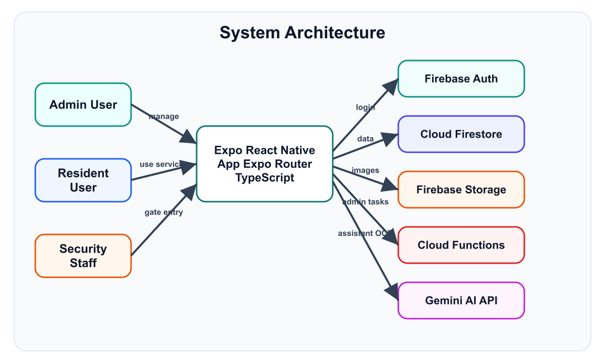
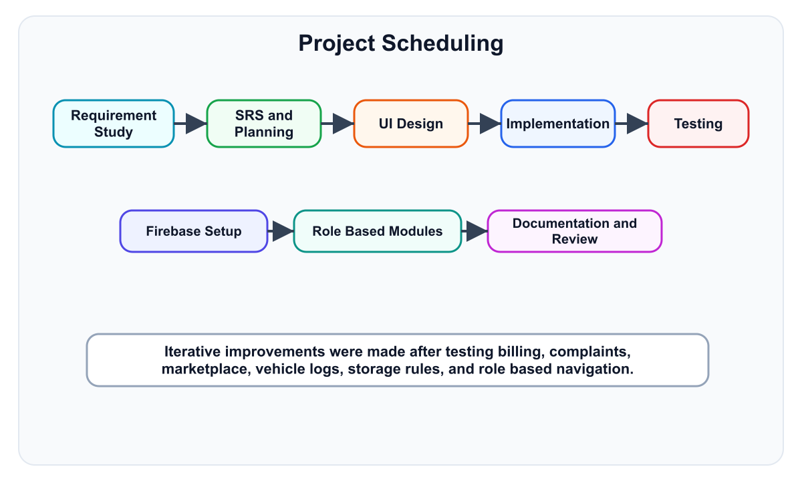
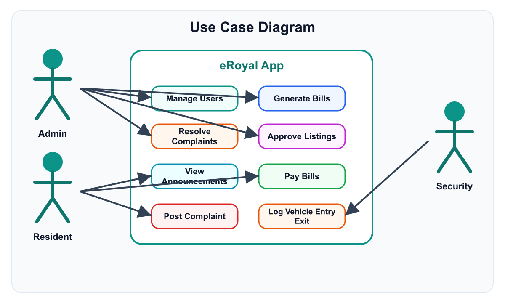
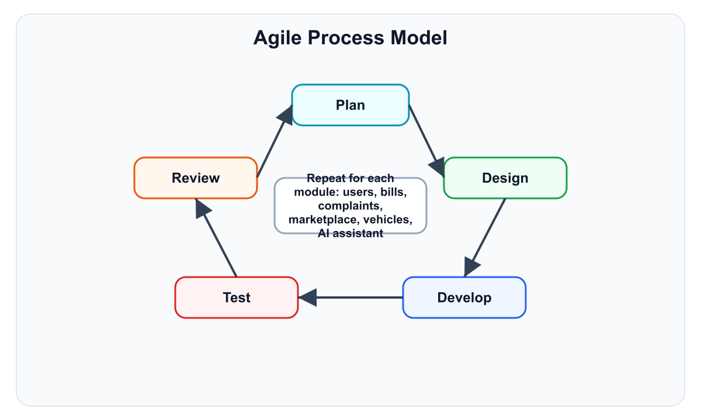
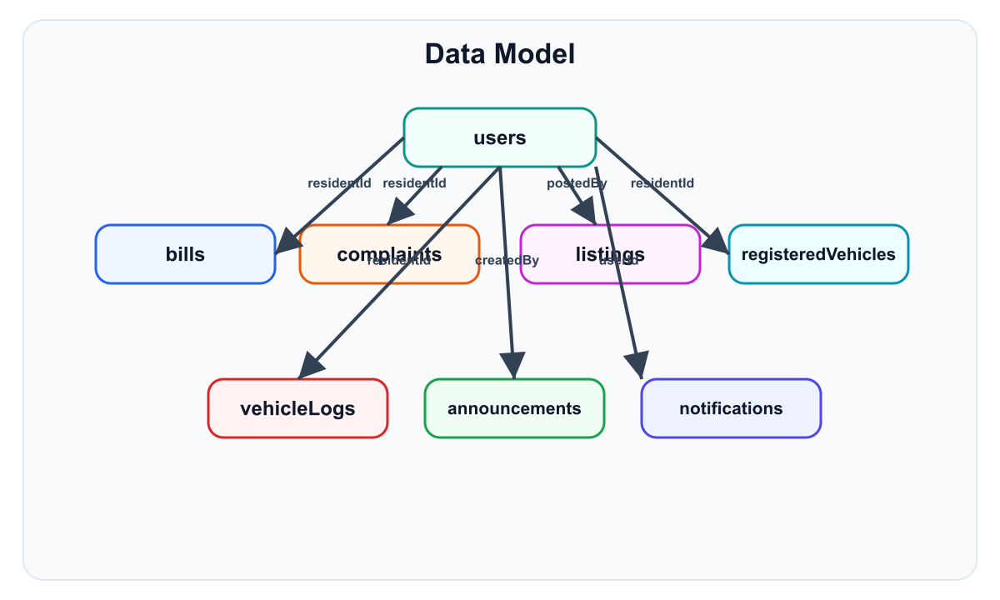
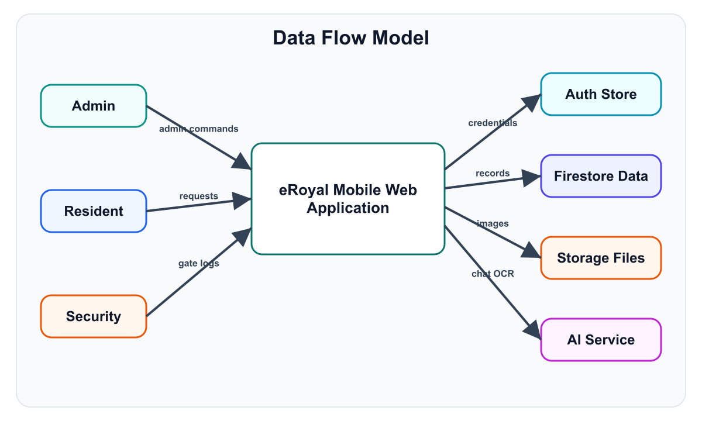
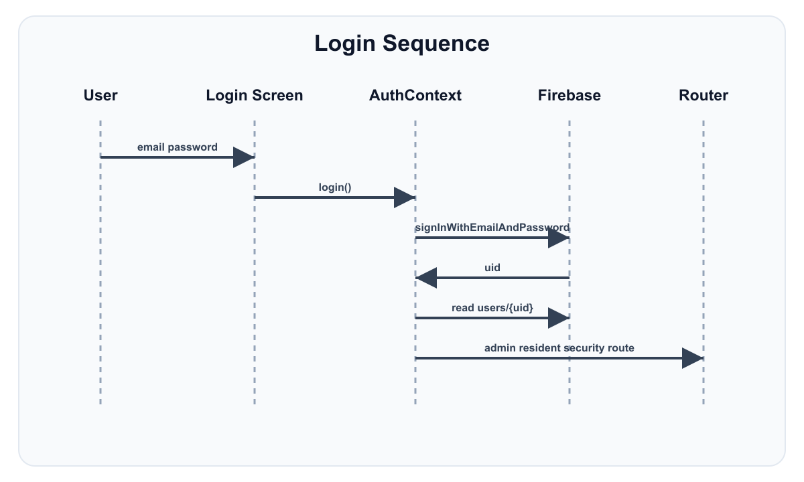
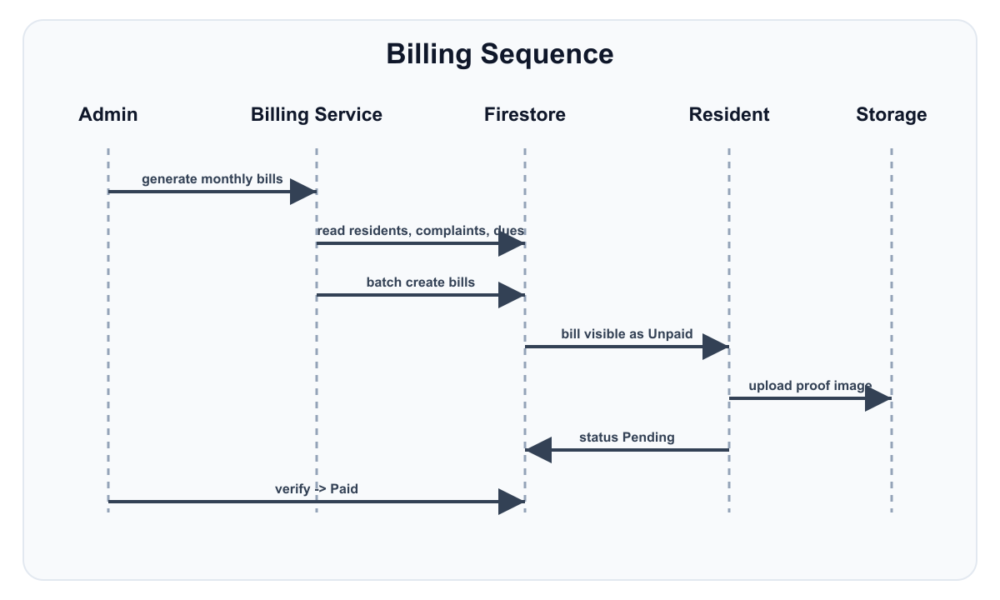
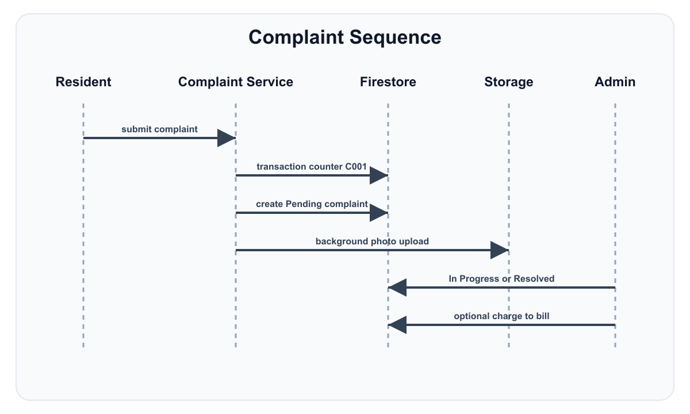
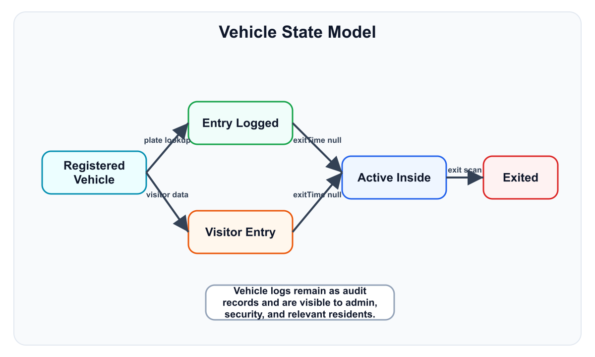

# Final Year Project Report

on

# eRoyal Housing Society Management System

Submitted By

[Your Roll Number]        [Your Name]

In Partial Fulfillment of

The Requirements for the Degree of

Bachelor of Science in Software Engineering

Supervised by: [Supervisor Name]

Department of Computer Sciences

[University Name]

Session: 2022-2026

---

# Dedication

I dedicate this project report to my parents, teachers, supervisor, and friends who supported me throughout the development of this project. Their guidance, patience, and encouragement helped me complete the eRoyal Housing Society Management System with confidence and consistency.

This work is also dedicated to the academic environment that helped me understand practical software engineering, requirement analysis, mobile application development, cloud database design, testing, and documentation.

---

# Acknowledgement

I am thankful to my supervisor for continuous guidance, useful feedback, and support during the planning, development, and documentation of this project. I am also thankful to the Department of Computer Sciences for providing the opportunity to build a real-world software project.

I also acknowledge the support of my family and friends, who encouraged me during research, implementation, testing, and final report preparation. The eRoyal project strengthened my understanding of React Native, Expo, Firebase, TypeScript, role-based access control, and cloud-based mobile app architecture.

Regards

[Your Name]

---

# Table of Contents

Chapter 1     Introduction and Background

1.1 Statement of Problem Area

1.2 Background History

1.3 Previous and Current Work

1.4 Project Description

1.5 Purpose

1.6 Objectives

1.7 Scope

1.8 Introduction

1.9 Tools and Technologies Used

1.10 Deployment Platform

1.11 Project Scheduling

Chapter 2     Software Requirements Specifications (SRS)

2.1 Functional Requirements

2.2 Nonfunctional Requirements

2.3 Project/Product Feasibility Report

Chapter 3     System Performance Requirements

Chapter 4     System Analysis and Design Overview

Chapter 5     User Interface Design

Chapter 6     System Verification and Validation

Chapter 7     Conclusions

Bibliography and References

Glossary

---

# List of Figures

Figure 1: Project scheduling for eRoyal

Figure 2: eRoyal system architecture

Figure 3: eRoyal use case diagram

Figure 4: Agile process model used for eRoyal

Figure 5: ER model for Firestore collections

Figure 6: Level 0 data flow diagram

Figure 7: Login and role routing sequence

Figure 8: Billing and payment verification sequence

Figure 9: Complaint lifecycle sequence

Figure 10: Vehicle gate state model

---

# List of Tables

Table 1: Tools and technologies used

Table 2: Deployment platform

Table 3: Functional requirements

Table 4: Non-functional requirements

Table 5: Feasibility summary

Table 6: Use case descriptions

Table 7: Data dictionary

Table 8: User interface specification

Table 9: Report formats and sample fields

Table 10: Error conditions and system messages

Table 11: Test cases and expected results

Table 12: Glossary

---

# Chapter 1

# Introduction and Background

## 1.1 Statement of Problem Area

Housing societies commonly manage resident records, monthly bills, complaints, announcements, marketplace notices, and gate vehicle entries through paper registers, WhatsApp groups, spreadsheets, or separate manual processes. This creates delays, weak tracking, duplicate work, and limited transparency for residents and management.

Residents often need to physically visit the office to ask about bills, submit complaints, confirm payment status, or request society information. Security staff also face difficulty verifying vehicle details quickly when vehicle records are stored manually. Admins have to maintain users, bills, complaint records, marketplace approvals, and announcements in different places, which increases the chance of human error.

The eRoyal Housing Society Management System solves this problem by providing one mobile and web application for admins, residents, and security staff. It centralizes authentication, billing, complaint management, announcements, property marketplace, registered vehicles, gate logs, image uploads, and AI-based resident assistance.

## 1.2 Background History

The management of modern housing societies is becoming more digital because residents expect fast communication, online records, and transparent service tracking. Traditional manual management methods are slow and difficult to scale when the number of residents, complaints, vehicles, and monthly bills increases.

Mobile applications are now widely used for community management because they allow residents to receive notices, upload payment proofs, report issues with photos, and view records at any time. Firebase-based systems are especially useful for such projects because they provide authentication, real-time database updates, file storage, and serverless functions without requiring a separate backend server.

## 1.3 Previous and Current Work

Previous society management methods usually depend on paper registers for gate entry, manual billing records, and informal communication channels for announcements. These systems provide limited search, weak security, and poor reporting.

Some existing applications provide partial society management features, but many do not combine role-based admin dashboards, resident services, security gate control, Firebase storage, real-time listeners, AI chatbot assistance, and license plate OCR in one project. eRoyal combines these services into a single cross-platform Expo application.

## 1.4 Project Description

eRoyal is a housing society management application built using React Native, Expo Router, TypeScript, and Firebase. The system supports three main roles: admin, resident, and security staff. Each role has its own protected routes and dashboard experience.

Admins can create users, generate monthly bills, verify payment proofs, resolve complaints, approve marketplace listings, create announcements, and monitor vehicle logs. Residents can view announcements, submit complaints, upload complaint photos, view and pay bills, upload payment proof, register vehicles, view gate logs, post property listings, and use the AI assistant. Security staff can log resident, visitor, and service vehicle entries and exits, use camera-based license plate scanning, and view active vehicles.

*Figure 2: eRoyal system architecture*

## 1.5 Purpose

The purpose of eRoyal is to make society administration faster, more transparent, and easier for residents, admins, and gate security staff. The project reduces manual paperwork and provides a centralized digital platform for all important society workflows.

- Provide a secure role-based login system for admin, resident, and security users.
- Allow admins to manage society members, bills, complaints, vehicles, listings, and announcements.
- Allow residents to access their own records and submit service requests from the app.
- Allow security staff to maintain accurate vehicle entry and exit logs.
- Store images such as payment proofs, complaint evidence, marketplace photos, vehicle photos, and profile pictures in Firebase Storage.
- Support AI assistance and license plate OCR through the Gemini API.
## 1.6 Objectives

- Design and develop a cross-platform housing society management system using Expo and React Native.
- Implement Firebase Authentication with role-based routing and route protection.
- Create a Firestore database model for users, bills, complaints, listings, vehicles, logs, announcements, counters, and notifications.
- Develop an admin module for user management, billing, complaint resolution, marketplace review, announcements, and vehicle monitoring.
- Develop a resident module for bills, payment proof upload, complaint submission, vehicle registration, marketplace, announcements, and AI chatbot.
- Develop a security module for gate entry, exit logging, active vehicle tracking, visitor handling, image capture, and plate recognition.
- Improve performance through real-time Firestore listeners, in-memory cache services, and client-side sorting where suitable.
- Protect data through Firestore rules, Storage rules, validation schemas, and role-specific access control.
## 1.7 Scope

The scope of eRoyal includes the core operations of a residential housing society. The project covers account creation by admin, authenticated access, monthly billing, payment proof verification, complaint management, property marketplace listings, announcements, vehicle registration, gate entry and exit logs, file uploads, and AI assistant support.

The project is suitable for a society office, resident mobile users, and gate security staff. It is not a banking system and does not directly process payments; instead, residents upload payment proof and admins verify the proof. It is also not a full ERP system, but it provides the main operational workflows needed for society management.

## 1.8 Introduction

eRoyal Housing Society Management System is a practical software engineering project that demonstrates mobile application development, cloud database integration, authentication, file storage, role-based access control, and software testing. The application is built with Expo Router and Firebase, making it suitable for Android, iOS, and web deployment.

## 1.9 Tools and Technologies Used

**Table 1: Tools and technologies used**

| Tool/Technology | Use in Project |
| --- | --- |
| React Native | Cross-platform mobile UI development |
| Expo SDK 54 | Development runtime, routing, build support, camera, image picker, splash screen |
| Expo Router | File-based navigation and role-specific route groups |
| TypeScript | Static typing for models, services, forms, and contexts |
| Firebase Authentication | Email/password login and authenticated sessions |
| Cloud Firestore | NoSQL database for users, bills, complaints, listings, vehicles, logs, announcements, notifications |
| Firebase Storage | Image uploads for proofs, complaints, vehicles, marketplace, announcements, and profiles |
| Firebase Cloud Functions | Admin-only deletion of Firebase Auth users |
| Google Gemini API | AI assistant and license plate OCR support |
| Zod | Form and input validation schemas |
| React Native Paper and Expo Vector Icons | UI components and iconography |
| GitHub | Version control and source hosting |

## 1.10 Deployment Platform

**Table 2: Deployment platform**

| Platform | Description |
| --- | --- |
| Android | Configured through Expo with package com.eroyal.app |
| iOS | Supported through Expo configuration with tablet support |
| Web | Static Expo web output configured in app.json |
| Firebase | Backend platform for auth, database, storage, rules, and functions |
| EAS | Expo Application Services project ID is configured for builds |
| AWS Amplify/Vercel-style static hosting option | amplify.yml and web static output are present for web deployment workflows |

## 1.11 Project Scheduling

The project was completed using an iterative approach. Requirement analysis and Firebase setup were followed by role-based UI development, service implementation, rule configuration, testing, and report preparation.

*Figure 1: Project scheduling for eRoyal*

# Chapter 2

# Software Requirements Specifications (SRS)

## 2.1 Functional Requirements

**Table 3: Functional requirements**

| ID | Requirement | Description | Priority |
| --- | --- | --- | --- |
| FR-01 | Login | Users must sign in using email and password through Firebase Authentication. | High |
| FR-02 | Role routing | System must redirect admin, resident, and security users to their own modules. | High |
| FR-03 | User management | Admin can create and view resident, admin, and security accounts. | High |
| FR-04 | Monthly billing | Admin can generate monthly bills for all residents or a single resident. | High |
| FR-05 | Payment proof upload | Residents can upload bill payment proof images. | High |
| FR-06 | Payment verification | Admin can approve or reject uploaded payment proof. | High |
| FR-07 | Complaint submission | Residents can create complaints with category, description, and optional photo. | High |
| FR-08 | Complaint resolution | Admin can update complaint status, add notes, and add optional charges to bills. | High |
| FR-09 | Marketplace listing | Residents can post property sale/rent listings with photos. | Medium |
| FR-10 | Listing approval | Admin can approve, reject, deactivate, or review listings. | High |
| FR-11 | Announcements | Admin can create announcements and residents can view them. | Medium |
| FR-12 | Vehicle registration | Residents can register vehicles and upload vehicle images. | High |
| FR-13 | Gate entry logging | Security can log resident, visitor, and service vehicle entry and exit. | High |
| FR-14 | OCR plate scanning | Security can use camera OCR to detect vehicle plates through Gemini. | Medium |
| FR-15 | AI assistant | Residents can ask society-related questions through the Gemini chatbot. | Medium |
| FR-16 | Notifications | System can create bill-related and workflow notifications. | Medium |

## 2.2 Nonfunctional Requirements

**Table 4: Non-functional requirements**

| Category | Requirement |
| --- | --- |
| Security | All protected operations require Firebase Authentication and role checks. Firestore and Storage rules enforce permissions. |
| Performance | App uses role-specific real-time contexts and client-side cache to reduce repeated database reads. |
| Reliability | Critical billing operations use Firestore batch writes and transactions for counters and bill generation. |
| Usability | Role-specific screens, status badges, image pickers, responsive helpers, and clear error messages improve user experience. |
| Maintainability | Code is organized into app routes, services, contexts, reusable components, types, and utilities. |
| Portability | Expo allows Android, iOS, and web builds from one React Native codebase. |
| Scalability | Firestore collections and Firebase Storage can scale without manual server administration. |
| Validation | Zod schemas validate email, password, CNIC, house number, bill, complaint, vehicle, and marketplace inputs. |

## 2.3 Project/Product Feasibility Report

**Table 5: Feasibility summary**

| Feasibility Type | Assessment |
| --- | --- |
| Technical Feasibility | The project is technically feasible because Expo, React Native, Firebase, and TypeScript are mature and widely supported. |
| Operational Feasibility | The system matches real housing society workflows for admin, resident, and security users. |
| Legal and Ethical Feasibility | The system uses authenticated access and rule-based restrictions. Sensitive data such as user profiles and payment proof images are protected by Firebase rules. |
| Economic Feasibility | Firebase and Expo provide low-cost development and hosting options suitable for academic and small society deployments. |
| Schedule Feasibility | The modular structure allows independent development and testing of auth, billing, complaints, marketplace, and gate modules. |
| Motivational Feasibility | The project solves a visible real-world problem and is useful for residents, admins, and security staff. |
| Information Feasibility | Required data is clearly represented in Firestore collections and TypeScript interfaces. |
| Specification Feasibility | Requirements are measurable through functional tests such as login, bill generation, complaint resolution, and gate entry logging. |

# Chapter 3

# System Performance Requirements

## 3.1 Efficiency

The application improves efficiency by using persistent real-time listeners in AppDataContext, AdminDataContext, and SecurityDataContext. Screens read already loaded data from context instead of repeatedly calling Firestore on each navigation. Billing generation also fetches residents and existing bills in parallel where possible.

## 3.2 Reliability

The system uses Firestore transactions for complaint number counters and batch writes for monthly bill generation. This helps prevent incomplete writes and inconsistent data when multiple documents must be updated together.

## 3.3 Security

Security is implemented through Firebase Authentication, role-based route guards, Firestore rules, Storage rules, role-specific collections, and admin-only Cloud Functions. Users can only perform operations allowed by their role.

## 3.4 Maintainability

The codebase separates UI screens from services, contexts, reusable components, utility functions, and TypeScript types. This makes it easier to modify one module without affecting unrelated modules.

## 3.5 Modification

New features can be added by creating a service, TypeScript type, screen route, and rules update. Existing modules such as listings, vehicles, complaints, and bills already follow this pattern.

## 3.6 Portability

The Expo configuration supports Android, iOS, and web. The project uses a single TypeScript React Native codebase and Firebase cloud services, so it does not depend on one local server platform.

# Chapter 4

# System Analysis and Design Overview

## 4.1 Use Case Diagrams

The main actors are Admin, Resident, and Security Staff. Admin manages the society, Resident uses services, and Security Staff handles gate operations.

*Figure 3: eRoyal use case diagram*

**Table 6: Use case descriptions**

| Use Case | Actor | Typical Flow | Alternate Flow |
| --- | --- | --- | --- |
| Login | All users | Enter email and password, Firebase verifies, app fetches role, route opens. | Invalid credentials show an error and user remains on login screen. |
| Generate Monthly Bills | Admin | Select month and base charges, system generates bills for residents. | Existing bills are skipped to avoid duplication. |
| Submit Complaint | Resident | Enter title, category, description, optional photo, system creates complaint number. | Photo upload can fail in background while complaint record remains saved. |
| Verify Payment | Admin | Open pending bills, inspect proof, approve or reject. | Rejected proof resets bill to Unpaid. |
| Log Vehicle Entry | Security | Scan/enter plate, select resident or visitor, save entry. | If OCR fails, plate can be entered manually. |

## 4.2 Software Process Model

The Agile iterative model was used because modules could be developed and tested independently. Authentication and Firebase setup were implemented first, followed by admin, resident, and security workflows.

*Figure 4: Agile process model used for eRoyal*

## 4.3 Data Model

The project uses Firestore as a NoSQL database. Each document is connected through UID fields such as residentId, postedBy, createdBy, loggedBy, userId, and billId.

*Figure 5: ER model for Firestore collections*

### 4.3.1 ER Model

The ER model shows how users connect to bills, complaints, marketplace listings, registered vehicles, vehicle logs, announcements, and notifications. In Firestore, these are separate collections connected through ID fields rather than relational foreign keys.

### 4.3.2 System Data Dictionary

**Table 7: Data dictionary**

| Collection | Main Fields | Purpose |
| --- | --- | --- |
| users | uid, name, email, houseNo, cnic, role, profilePictureUrl, createdAt, createdBy | Unified user profiles for admin, resident, and security roles. |
| residents/admins/security_staff | uid, name, email, role, houseNo, cnic, createdAt | Legacy role-specific profile collections kept for compatibility. |
| bills | residentId, residentName, houseNo, month, breakdown, amount, dueDate, status, proofUrl, verifiedBy | Monthly bills and payment verification workflow. |
| complaints | complaintNumber, title, description, category, imageUrl, status, residentId, resolutionNotes, chargeAmount | Resident complaints and admin resolution tracking. |
| listings | type, price, size, location, contact, description, photos, status, postedBy, reviewedBy | Property sale/rent marketplace with admin approval. |
| registeredVehicles | vehicleNo, type, color, imageUrl, residentId, residentName, houseNo | Resident vehicle registry. |
| vehicleLogs | vehicleNo, type, entryTime, exitTime, residentId, houseNo, visitorName, purpose, photoUrl, exitPhotoUrl | Gate entry and exit audit records. |
| announcements | title, message, priority, imageUrls, createdBy, createdByName, createdAt | Official notices created by admin. |
| notifications | userId, title, message, type, isRead, relatedId, createdAt | In-app workflow notifications. |
| counters | count | Auto-increment support for complaint numbers. |

## 4.4 Behavioral Models

### 4.4.1 Data Flow Models

Data flows from role-specific screens to service functions and then to Firebase services. Images are stored in Firebase Storage while metadata and workflow statuses are stored in Firestore.

*Figure 6: Level 0 data flow diagram*

### 4.4.2 System Sequence Models

The following sequence models explain authentication, billing, complaint management, and vehicle gate processes.

*Figure 7: Login and role routing sequence*

*Figure 8: Billing and payment verification sequence*

*Figure 9: Complaint lifecycle sequence*

## 4.5 Object Models

The object model is represented through TypeScript interfaces. Main entities include User, Bill, Complaint, Listing, VehicleLog, RegisteredVehicle, Notification, and ApiResponse. These interfaces keep service and UI code consistent.

### 4.5.1 State Models

Important workflow states include Bill status (Draft, Unpaid, Pending, Paid), Complaint status (Pending, In Progress, Resolved), Listing status (Pending, Approved, Rejected, Sold, Inactive), and Vehicle state (registered, entered, active inside, exited).

*Figure 10: Vehicle gate state model*

### 4.5.2 Class Inheritance Model

The project uses React components, hooks, contexts, and TypeScript interfaces rather than a deep class inheritance hierarchy. ErrorBoundary is a class component, while most business logic is organized as service functions.

## 4.6 Implementation Languages

- TypeScript is used for the Expo app, services, contexts, components, and validation.
- JavaScript is used for helper scripts such as admin claim setup and project scripts.
- Firebase Rules language is used for Firestore and Storage security rules.
- JSON is used for Expo, Firebase, EAS, TypeScript, and package configuration files.
## 4.7 Required Support Software

- Node.js and npm for project dependency installation and scripts.
- Expo CLI for running Android, iOS, and web development builds.
- Firebase project with Authentication, Firestore, Storage, and Functions enabled.
- Gemini API key for chatbot and OCR features.
- Android Studio or Expo Go for mobile testing.
- Modern browser for web testing.
# Chapter 5

# User Interface Design

## 5.1 User Interface Specification

The eRoyal interface uses a teal primary color, refined grey surfaces, status colors, responsive spacing, reusable cards, buttons, inputs, avatars, status badges, loading states, and role-specific navigation stacks.

**Table 8: User interface specification**

| Module | Screens | Main UI Functions |
| --- | --- | --- |
| Authentication | Login, Forgot Password | Email/password login, password reset, role-based redirect. |
| Admin | Dashboard, Users, Bills, Complaints, Marketplace, Announcements, Vehicles | Statistics, management lists, create forms, detail pages, approvals, verification. |
| Resident | Home, Bills, Complaints, Marketplace, Vehicles, Announcements, Chatbot, Change Password | Quick actions, personal records, uploads, listings, vehicle registration, AI help. |
| Security | Gate Entry | Resident entry, visitor entry, exit tab, active vehicles, camera capture, OCR. |
| Common Components | Button, Card, Input, Avatar, StatusBadge, SkeletonLoader, ImagePicker, ErrorBoundary | Reusable design and error handling elements. |

### 5.1.1 User Interface Designs

The admin dashboard provides navigation cards for user management, bills, complaints, marketplace, vehicle logs, and announcements. The resident home screen displays greeting, profile avatar, unpaid bill count, complaint status, vehicle summary, quick links, and settings. The security screen is optimized for gate use with tabs for resident entry, visitor entry, and exit processing.

### 5.1.2 Report Formats/Sample Data

The system stores structured data in Firestore and displays list/detail views. Example reports include bill status lists, pending payment proofs, complaint queues, marketplace approval queues, and vehicle log history.

**Table 9: Report formats and sample fields**

| Report/View | Sample Fields |
| --- | --- |
| Bill Details | Resident name, house number, month, base charges, complaint charges, previous dues, amount, due date, status, proof image. |
| Complaint Details | Complaint number, title, category, description, resident name, house number, status, image, notes, charge amount. |
| Vehicle Log | Vehicle number, type, entry time, exit time, resident/visitor details, purpose, logged by, gate photo. |
| Marketplace Listing | Type, price, size, location, contact, description, photos, status, reviewer, rejection reason. |

## 5.2 User Support

User support is provided through clear forms, validation errors, status badges, loading indicators, image previews, confirmation alerts, and an AI assistant for resident guidance. Admin and security users are guided through specialized dashboards rather than generic menus.

### 5.2.1 Online Help Material

The resident AI assistant can answer society-related questions about bills, complaints, gate security, vehicles, marketplace rules, announcements, and app navigation. The README and docs folder also provide setup and testing guidance.

### 5.2.2 Error Conditions and System Messages

**Table 10: Error conditions and system messages**

| Condition | System Message/Handling |
| --- | --- |
| Invalid login | Displays invalid email or password error and keeps user on login page. |
| Missing resident house number | Create user form requires house number for resident role. |
| Duplicate vehicle number | Vehicle service rejects already registered normalized plate number. |
| Payment proof rejected | Bill proof fields are cleared and status returns to Unpaid. |
| Missing Gemini API key | AI and OCR services return configuration error or skip OCR safely. |
| Unauthorized access | Route guard redirects user to the correct role area or login screen. |
| Image too large or invalid type | Firebase Storage rules reject invalid uploads. |

# Chapter 6

# System Verification and Validation

## 6.1 Items/Functions to be Tested

- Authentication for admin, resident, and security roles.
- Admin user creation and role-specific profile writing.
- Monthly bill generation, payment proof upload, and admin verification.
- Complaint creation, status update, resolution notes, and complaint charges.
- Marketplace listing creation, approval, rejection, inactive, and sold workflows.
- Announcement creation and resident announcement display.
- Vehicle registration, duplicate plate detection, entry logging, exit logging, and active vehicle list.
- Firebase Firestore rules and Firebase Storage rules.
- AI assistant and OCR fallback behavior.
## 6.2 Description of Test Cases

**Table 11: Test cases and expected results**

| Test ID | Test Case | Input/Steps | Expected Result |
| --- | --- | --- | --- |
| TC-01 | Admin login | Login with valid admin credentials. | Admin dashboard opens. |
| TC-02 | Create resident | Admin enters name, email, password, resident role, house number. | Resident auth account and Firestore profile are created. |
| TC-03 | Create security account | Admin creates security user. | Security account can access gate entry only. |
| TC-04 | Generate bill | Admin selects month and base charges. | Bills are created for residents and duplicates are skipped. |
| TC-05 | Resident payment proof | Resident opens bill and uploads proof image. | Bill status changes to Pending. |
| TC-06 | Verify payment | Admin approves pending proof. | Bill status changes to Paid and verification fields are saved. |
| TC-07 | Submit complaint | Resident submits complaint with category and optional photo. | Complaint number is generated and status is Pending. |
| TC-08 | Resolve complaint | Admin adds notes and resolves complaint. | Complaint status becomes Resolved and optional charge is handled. |
| TC-09 | Post listing | Resident posts property listing with photos. | Listing status starts as Pending. |
| TC-10 | Approve listing | Admin approves pending listing. | Listing becomes visible as Approved. |
| TC-11 | Security gate entry | Security enters or scans vehicle number and logs entry. | VehicleLog document is created with entryTime. |
| TC-12 | Vehicle exit | Security selects active vehicle and logs exit. | exitTime is updated and vehicle leaves active list. |

## 6.3 Justification of Test Cases

The selected test cases cover all critical workflows of the system: login, role access, user management, billing, payments, complaints, marketplace, announcements, vehicle security, image upload, and Firebase-backed data updates. These cases validate both functional behavior and role-based restrictions.

## 6.4 Test Run Procedures and Results

Testing can be performed by running the Expo development server, creating one admin account, creating test resident and security accounts, and then executing each workflow from the Testing Guide. Successful completion means users are routed correctly, Firestore documents are created or updated, Storage images are uploaded, and dashboards show updated live data.

# Chapter 7

# Conclusions

## 7.1 Summary

The eRoyal Housing Society Management System successfully digitizes the main operations of a housing society. It provides secure login, admin management, resident self-service, security gate control, image upload workflows, Firebase cloud storage, Firestore database records, and AI support in one Expo application.

The project demonstrates practical software engineering concepts including SRS preparation, modular architecture, UI design, validation, cloud database modeling, role-based security, testing, and deployment planning.

## 7.2 Problems Encountered and Solved

- Role-based routing was solved by using AuthContext and route group checks in the root layout.
- Repeated Firestore reads were reduced by using AppDataContext, AdminDataContext, and SecurityDataContext with onSnapshot listeners.
- Billing consistency was improved using batch writes, previous dues logic, complaint charge integration, and duplicate bill checks.
- Image upload delays were reduced by saving records first and uploading photos in the background for complaints, listings, and announcements.
- Vehicle number mismatches were reduced by normalizing house numbers and vehicle numbers before search and storage.
- User creation without logging out the admin was solved by using a temporary secondary Firebase app with in-memory auth persistence.
- Data protection was improved through Firestore rules, Storage rules, and Cloud Function admin checks.
## 7.3 Suggestions for Better Approaches to Project

- Add automated unit and integration tests for services and validation schemas.
- Add admin analytics charts for bills, complaints, vehicles, and listings.
- Add push notifications for bill generation, payment verification, complaint updates, and visitor entry.
- Use a dedicated backend API for complex reporting if data volume becomes very large.
- Add CI/CD workflows to run lint, build, and tests before release.
## 7.4 Suggestions for Future Extensions to Project

- Online payment gateway integration instead of manual proof upload.
- Visitor pre-approval by residents before a guest reaches the gate.
- QR-based resident and visitor entry passes.
- Advanced admin reporting and export to PDF/Excel.
- Multilingual interface for English and Urdu users.
- Push notifications and SMS alerts.
- Maintenance staff module for assigning and tracking complaint work orders.
- Backup and audit dashboard for admin actions.
# Bibliography and References

1. React Native Documentation. https://reactnative.dev/docs/getting-started

2. Expo Documentation. https://docs.expo.dev/

3. Expo Router Documentation. https://docs.expo.dev/router/introduction/

4. Firebase Authentication Documentation. https://firebase.google.com/docs/auth

5. Cloud Firestore Documentation. https://firebase.google.com/docs/firestore

6. Firebase Storage Documentation. https://firebase.google.com/docs/storage

7. Firebase Cloud Functions Documentation. https://firebase.google.com/docs/functions

8. TypeScript Documentation. https://www.typescriptlang.org/docs/

9. Zod Documentation. https://zod.dev/

10. Google Generative AI Documentation. https://ai.google.dev/

11. GitHub Repository: https://github.com/mudassarbajwa49/eRoyal

---

# Glossary

**Table 12: Glossary**

| Term | Meaning |
| --- | --- |
| eRoyal | Housing society management application developed in this project. |
| Admin | User role responsible for management, billing, complaints, listings, announcements, and monitoring. |
| Resident | Society member who can view bills, submit complaints, register vehicles, and use resident services. |
| Security Staff | Gate user responsible for vehicle entry and exit logging. |
| Firebase Auth | Authentication service used for email/password login. |
| Firestore | Firebase NoSQL cloud database used for app records. |
| Firebase Storage | Cloud file storage used for images and proofs. |
| Cloud Functions | Serverless backend used for privileged admin operations. |
| Expo Router | File-based navigation system for the React Native app. |
| Bill Status | Workflow state such as Draft, Unpaid, Pending, or Paid. |
| Complaint Status | Workflow state such as Pending, In Progress, or Resolved. |
| Listing Status | Marketplace review state such as Pending, Approved, Rejected, Sold, or Inactive. |
| VehicleLog | Gate entry/exit record for a resident, visitor, or service vehicle. |
| OCR | Optical character recognition used to detect license plate text from camera images. |
| RBAC | Role-based access control that limits each user to permitted actions. |
| SRS | Software Requirements Specifications. |
